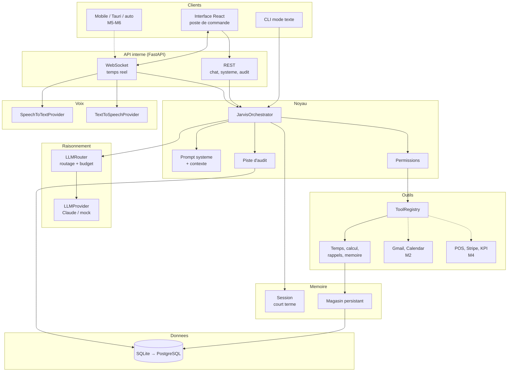
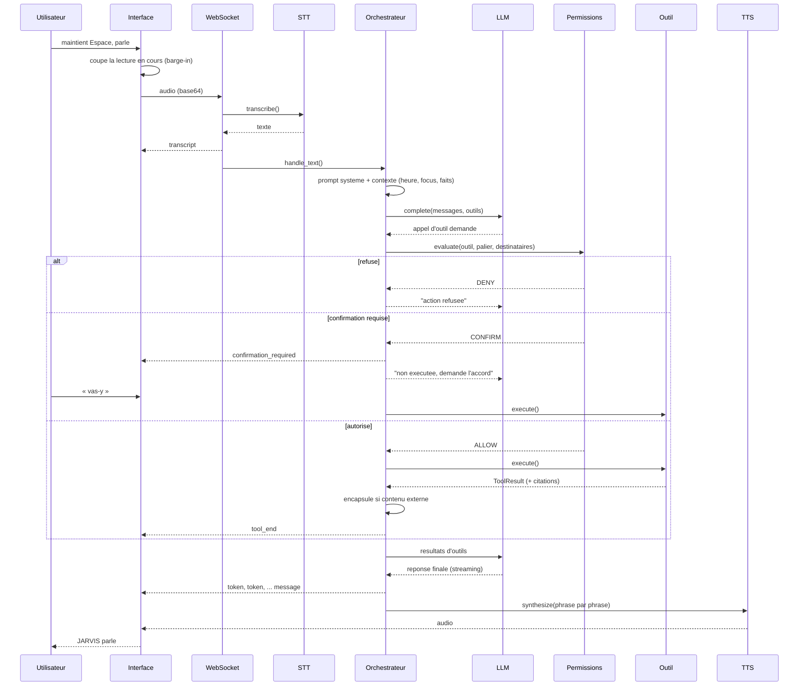
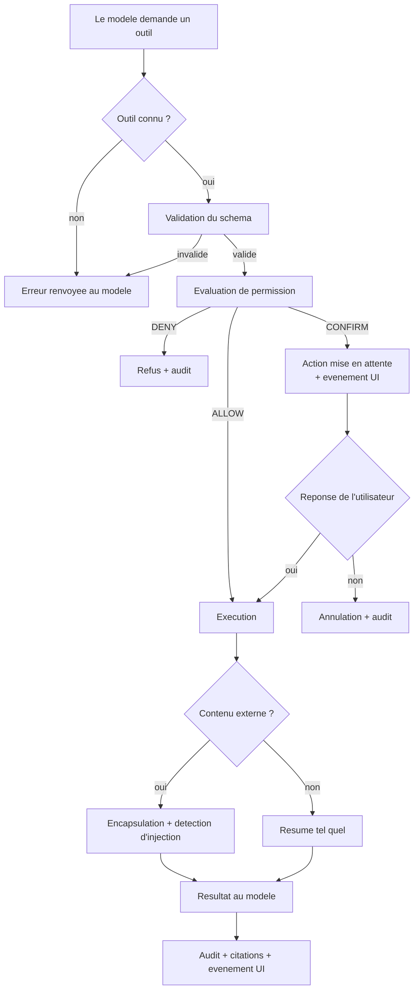
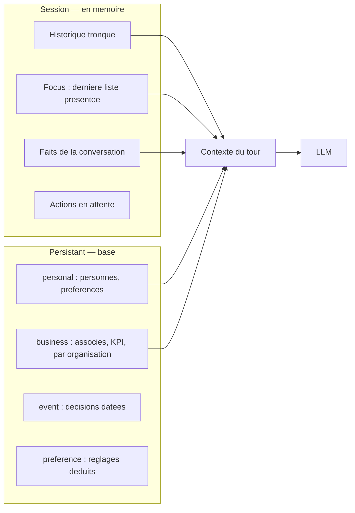
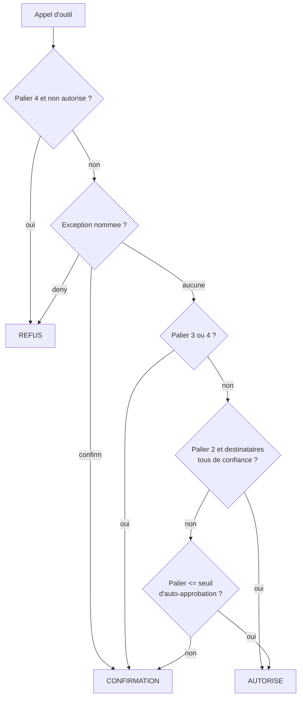
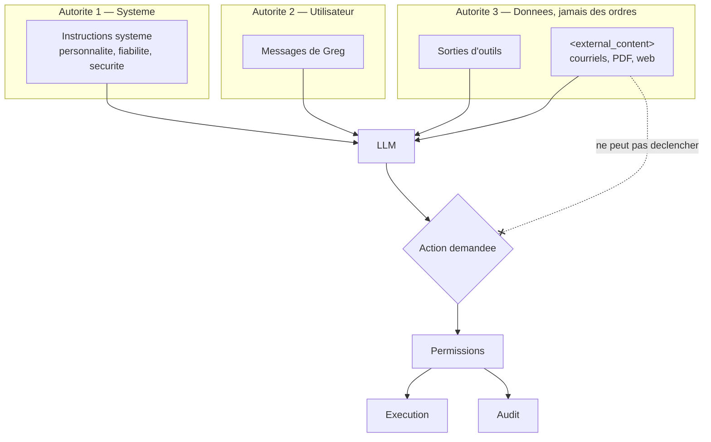
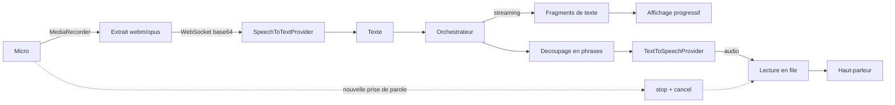
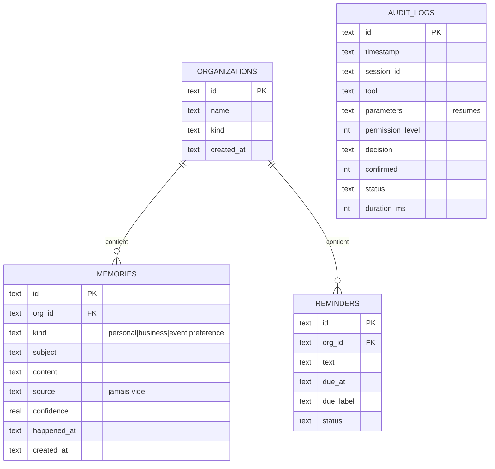

# Architecture de JARVIS

Ce document explique **ce qui a ete choisi et pourquoi**. Il evolue avec le
projet ; chaque jalon y ajoute sa section.

---

## 1. Principes directeurs

Cinq regles ont tranche la plupart des arbitrages techniques.

1. **Fiabilite avant puissance.** Un assistant qui repond parfois faux est pire
   qu'un assistant limite mais honnete. Toute information non obtenue par un
   outil ou par la memoire n'existe pas.
2. **Le contenu externe n'est jamais une instruction.** Un courriel, un PDF ou
   une page web sont des donnees. Cette frontiere est materialisee dans le code,
   pas seulement dans le prompt.
3. **Le risque est explicite.** Chaque action porte un palier de permission ; les
   paliers dangereux ne peuvent pas etre auto-approuves.
4. **Extensible sans toucher au cerveau.** Ajouter une capacite = declarer un
   outil. L'orchestrateur ne change pas.
5. **Pas de complexite prematuree.** Monolithe modulaire, SQLite, un processus.
   Les frontieres sont posees pour pouvoir decouper plus tard, pas maintenant.

---

## 2. Choix technologiques

| Decision | Retenu | Alternatives ecartees | Raison |
|---|---|---|---|
| Langage backend | Python 3.11 | Node.js, Go | Ecosysteme IA/audio (Whisper, embeddings, parseurs de documents) sans equivalent ; async natif suffisant pour de l'I/O |
| Framework | FastAPI | Flask, Django | Async natif, WebSocket, validation Pydantic, OpenAPI gratuit |
| Interface | React 19 + Vite + TypeScript | Svelte, Vue | Typage strict ; se reutilise tel quel en desktop, web et mobile |
| Desktop | Navigateur (M1) → Tauri (M5) | Electron | Tauri : ~10 Mo contre ~120 Mo, moins de RAM, meme code React |
| Base | SQLite (M1) → PostgreSQL + pgvector (M4) | PostgreSQL d'emblee | Rien a installer sous Windows ; le SQL ecrit est deja portable |
| Recherche vectorielle | pgvector (M3/M4) | Pinecone, Chroma | Une seule base a sauvegarder ; le filtrage par metadonnees est du SQL |
| LLM | Claude `claude-opus-5` | GPT, modeles locaux | Meilleur usage d'outils et respect des consignes de securite. Abstrait derriere `LLMProvider` : changer de fournisseur = une classe |
| Temps reel | WebSocket | SSE, polling | Bidirectionnel : audio montant, evenements descendants, interruption |
| Confidentialite audio | STT local possible | Cloud uniquement | `faster_whisper` garde la voix sur la machine |

### Pourquoi un monolithe modulaire

Un assistant personnel a un utilisateur. Le decoupage en services couterait de
la latence (chaque saut reseau se paie dans une conversation vocale) et du temps
d'exploitation, pour aucun gain. Les frontieres de modules sont nettes, donc le
jour ou un composant doit sortir — par exemple un service de documents avec
GPU — il sort sans reecriture.

### Routage de modele

Trois niveaux, configurables :

| Niveau | Modele par defaut | Usage |
|---|---|---|
| `FAST` | `claude-haiku-4-5` | Salutations, confirmations, tours triviaux |
| `BALANCED` | `claude-opus-5` | Conversation avec outils (defaut) |
| `DEEP` | `claude-opus-5`, effort eleve | Analyse documentaire, raisonnement long |

Le choix se fait sur la forme du tour, pas sur une devinette du modele. Un
budget quotidien coupe net les appels au-dela du plafond configure.

---

## 3. Vue d'ensemble

Trait plein : implemente. Trait pointille : contrat fige, implementation a venir.

---

## 4. Cycle de vie d'un tour

Point important : le modele ne recoit **jamais** le resultat brut d'un outil
marque comme externe. Il recoit un bloc encapsule qui dit explicitement que ce
qu'il contient n'est pas une instruction.

---

## 5. Appel d'outils

La validation de schema est faite dans le registre, jamais dans les handlers :
un outil peut donc supposer que ses parametres sont conformes. Les proprietes
inconnues proposees par le modele sont jetees.

---

## 6. Memoire

**Focus et references.** Quand un outil presente une liste (rendez-vous,
courriels, rappels), il enregistre un `focus`. « le deuxieme », « le dernier »,
« celui-la » se resolvent dessus. Si la reference reste ambigue, JARVIS demande
plutot que de deviner.

**Troncature sure.** L'historique est coupe sans jamais separer un appel d'outil
de son resultat, et il recommence toujours par un vrai message utilisateur —
sinon l'API rejette la conversation.

**Aucun souvenir sans source.** Chaque entree persistante porte `source` et
`confidence`. On peut toujours repondre « d'ou tu sors ca ? ».

**Contexte etroit.** On n'envoie pas toute la vie de l'utilisateur a chaque
tour : heure courante, focus, faits recents, capacites actives. La recherche
lexicale du M1 sera remplacee par de la recherche semantique en M3 — la
signature de `MemoryStore.search()` ne changera pas.

---

## 7. Permissions

| Palier | Nom | Exemples |
|---|---|---|
| 0 | `READ` | lire le calendrier, chercher un courriel, consulter des ventes, calculer |
| 1 | `LOW_WRITE` | creer une note, un rappel, un brouillon |
| 2 | `EXTERNAL_COMM` | envoyer un courriel, un message, une reponse |
| 3 | `SENSITIVE` | supprimer un fichier, annuler un meeting, modifier des donnees business |
| 4 | `CRITICAL` | virement bancaire, suppression massive, changement de permissions |

**Invariant teste :** meme avec `auto_approve_max_level` au maximum, les paliers
3 et 4 ne sont jamais auto-approuves. La configuration elle-meme refuse un seuil
superieur a 2.

**Confirmations naturelles.** Quand une confirmation est requise, l'outil n'est
pas execute ; le modele recoit une consigne et formule la question lui-meme
(« J'ai prepare le message. Je l'envoie ? »). Un « oui » declenche l'action, un
« non » l'annule, et un changement de sujet l'abandonne — elle ne reste pas en
embuscade.

---

## 8. Modele de securite

**Defenses en profondeur contre l'injection**

1. Separation des autorites, materialisee dans le format des messages.
2. Encapsulation de tout contenu externe dans un bloc balise, avec avertissement.
3. Neutralisation des chevrons : le contenu ne peut pas refermer son propre bloc.
4. Detection des formulations d'injection connues (francais et anglais), signalee
   au modele et a l'utilisateur, et journalisee.
5. Barriere finale : meme convaincu, le modele se heurte aux permissions. Une
   suppression massive est palier 4, donc refusee.

**Secrets.** Aucune cle dans le code. `.env` ignore par Git. Jetons chiffres au
repos (Fernet). Filtre de redaction sur tous les logs. En production, la cle de
chiffrement est obligatoire.

**Audit.** `timestamp, session, requete, outil, action, parametres resumes,
palier, decision, confirmation, statut, duree, resultat, signaux d'injection`.
Les champs sensibles (corps de courriel, mots de passe) sont remplaces par leur
taille, pas par leur contenu.

---

## 9. Pipeline vocal

**Latence.** La metrique qui compte est *fin de parole → premier son de
reponse*. Les leviers, du plus au moins efficace :

1. TTS phrase par phrase — la lecture demarre avant la fin de la generation ;
2. modele rapide sur les tours triviaux ;
3. effort de raisonnement bas par defaut en conversation ;
4. prompt systeme mis en cache (prefixe stable) ;
5. STT local en modele `small` ou `base`.

**Interruption (barge-in).** Immediate cote client : reprendre la parole coupe
la lecture. Cooperative cote serveur : un `cancel` est envoye et le tour en cours
s'arrete a la prochaine etape verifiable.

**Wake word (M5).** Detection locale (`Porcupine` ou equivalent) dans un service
en arriere-plan, qui declenche le meme pipeline. Rien a changer au coeur.

---

## 10. Modele de donnees

Seules les tables necessaires au stade actuel existent. `documents`,
`document_chunks`, `oauth_tokens`, `contacts`, `events` arriveront avec leurs
jalons, par migration.

**Multi-organisation.** `org_id` est present des maintenant sur les donnees
metier. « Mes ventes aujourd'hui » pourra demander de quelle entreprise il
s'agit, ou deduire du contexte recent.

---

## 11. Protocole temps reel

Client → serveur :

| Message | Effet |
|---|---|
| `{type:"text", text}` | Tour en mode texte |
| `{type:"audio", audio_base64, mime}` | Tour vocal |
| `{type:"confirm", action_id, approved}` | Reponse a une confirmation |
| `{type:"cancel"}` | Interruption |
| `{type:"org", organization}` | Change l'organisation active |
| `{type:"reset"}` | Vide la session |

Serveur → client : `state`, `transcript`, `token`, `tool_start`, `tool_end`,
`confirmation_required`, `message`, `citations`, `audio`, `error`, `metrics`.

L'interface affiche **les actions et les resultats**, jamais le raisonnement
interne du modele.

---

## 12. Ce que le M1 ne fait pas encore

Enonce explicitement pour eviter toute illusion :

- pas de Gmail, Calendar, Contacts, Drive (M2) ;
- pas de lecture de documents ni de recherche semantique (M3) ;
- pas de donnees d'entreprise (M4) ;
- pas de wake word, pas de service en arriere-plan, pas de notifications
  proactives, pas de briefing quotidien, pas de controle de l'ordinateur (M5) ;
- pas de recherche web ;
- pas de graphe de connaissances — il sera evalue en M4, seulement s'il apporte
  une valeur reelle par rapport a la recherche semantique + metadonnees.

Les contrats d'outils Google sont deja figes et **refusent explicitement** de
repondre tant que OAuth n'est pas branche. C'est voulu : JARVIS doit dire
« Gmail n'est pas encore connecte », jamais simuler une boite de reception.
