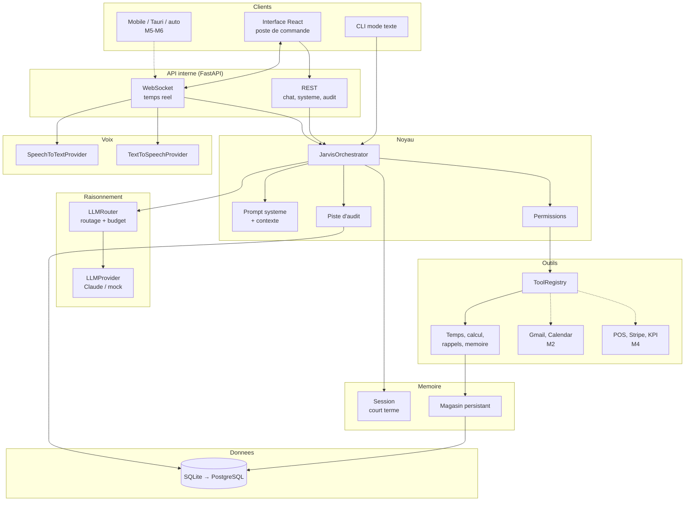
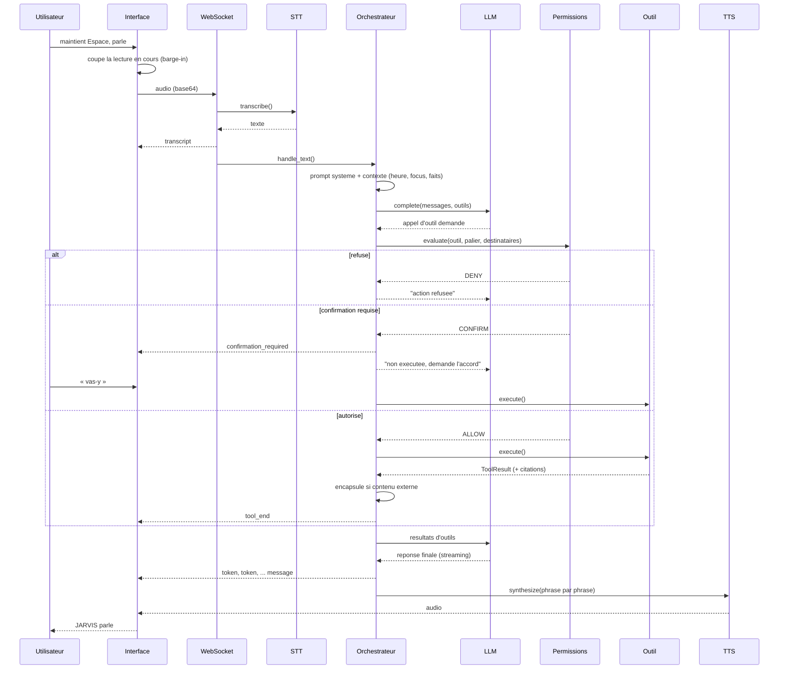
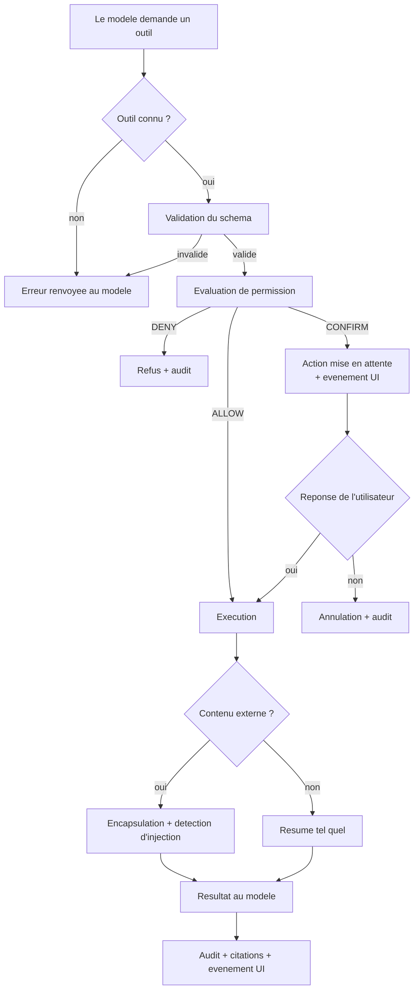
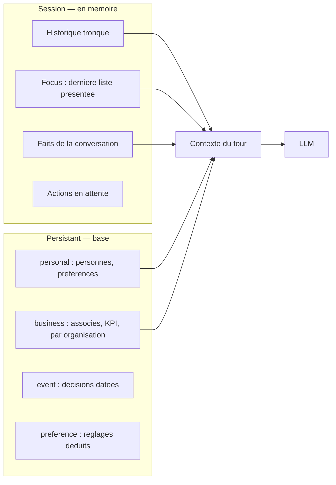
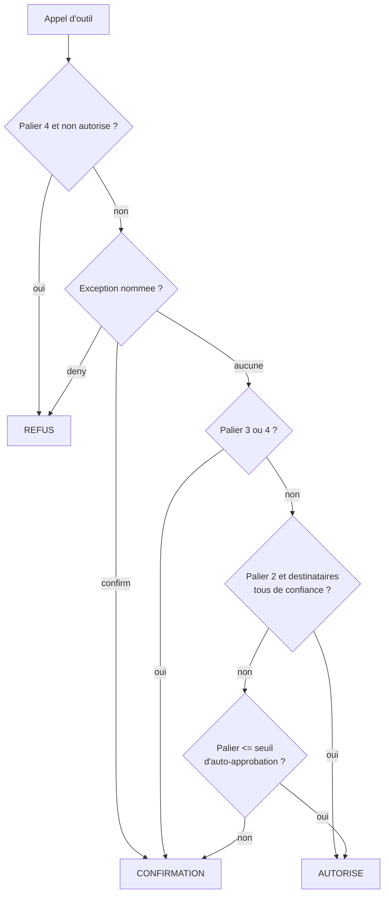
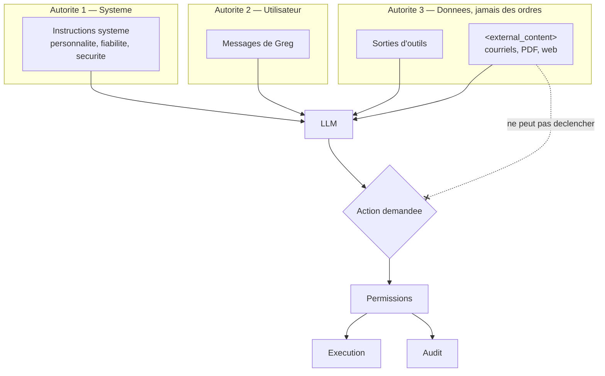
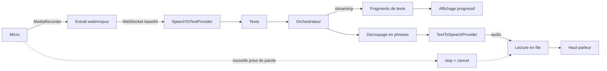
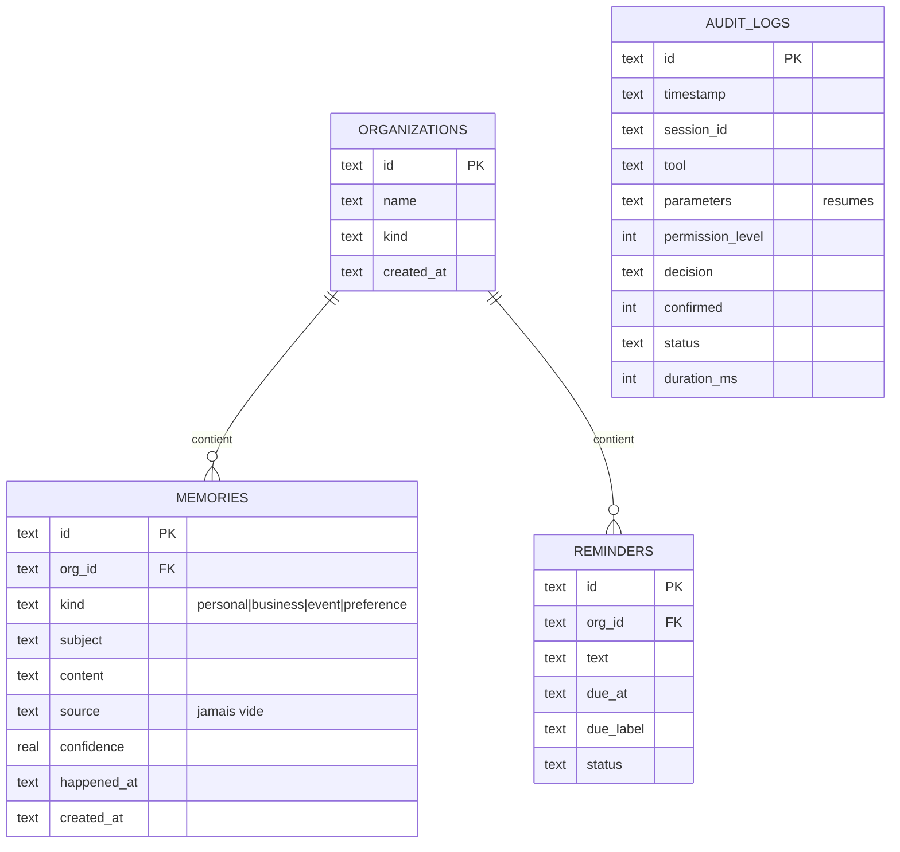
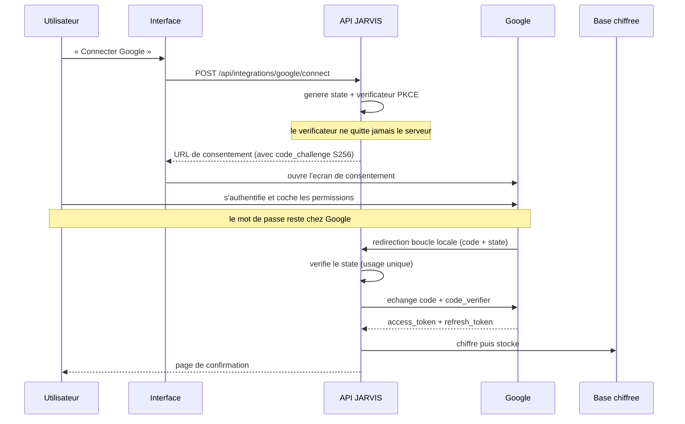
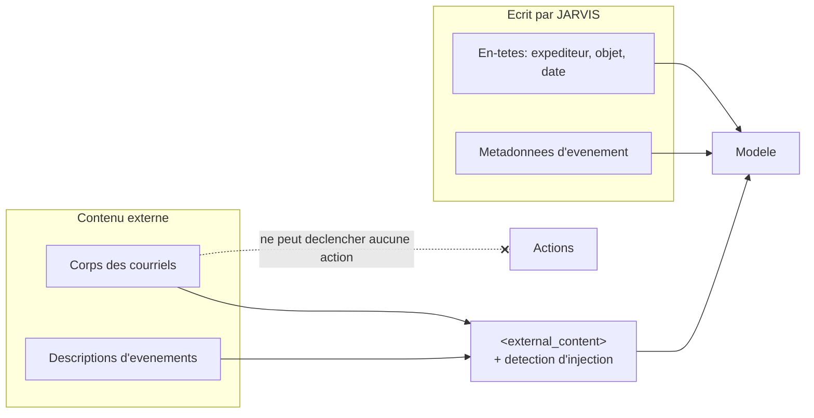

# Architecture de JARVIS

Ce document explique **ce qui a ete choisi et pourquoi**. Il evolue avec le
projet ; chaque jalon y ajoute sa section.

---

## 1. Principes directeurs

Cinq regles ont tranche la plupart des arbitrages techniques.

1. **Fiabilite avant puissance.** Un assistant qui repond parfois faux est pire
   qu'un assistant limite mais honnete. Toute information non obtenue par un
   outil ou par la memoire n'existe pas.
2. **Le contenu externe n'est jamais une instruction.** Un courriel, un PDF ou
   une page web sont des donnees. Cette frontiere est materialisee dans le code,
   pas seulement dans le prompt.
3. **Le risque est explicite.** Chaque action porte un palier de permission ; les
   paliers dangereux ne peuvent pas etre auto-approuves.
4. **Extensible sans toucher au cerveau.** Ajouter une capacite = declarer un
   outil. L'orchestrateur ne change pas.
5. **Pas de complexite prematuree.** Monolithe modulaire, SQLite, un processus.
   Les frontieres sont posees pour pouvoir decouper plus tard, pas maintenant.

---

## 2. Choix technologiques

| Decision | Retenu | Alternatives ecartees | Raison |
|---|---|---|---|
| Langage backend | Python 3.11 | Node.js, Go | Ecosysteme IA/audio (Whisper, embeddings, parseurs de documents) sans equivalent ; async natif suffisant pour de l'I/O |
| Framework | FastAPI | Flask, Django | Async natif, WebSocket, validation Pydantic, OpenAPI gratuit |
| Interface | React 19 + Vite + TypeScript | Svelte, Vue | Typage strict ; se reutilise tel quel en desktop, web et mobile |
| Desktop | Navigateur (M1) → Tauri (M5) | Electron | Tauri : ~10 Mo contre ~120 Mo, moins de RAM, meme code React |
| Base | SQLite (M1) → PostgreSQL + pgvector (M4) | PostgreSQL d'emblee | Rien a installer sous Windows ; le SQL ecrit est deja portable |
| Recherche vectorielle | pgvector (M3/M4) | Pinecone, Chroma | Une seule base a sauvegarder ; le filtrage par metadonnees est du SQL |
| LLM | Claude `claude-opus-5` | GPT, modeles locaux | Meilleur usage d'outils et respect des consignes de securite. Abstrait derriere `LLMProvider` : changer de fournisseur = une classe |
| Temps reel | WebSocket | SSE, polling | Bidirectionnel : audio montant, evenements descendants, interruption |
| Confidentialite audio | STT local possible | Cloud uniquement | `faster_whisper` garde la voix sur la machine |

### Pourquoi un monolithe modulaire

Un assistant personnel a un utilisateur. Le decoupage en services couterait de
la latence (chaque saut reseau se paie dans une conversation vocale) et du temps
d'exploitation, pour aucun gain. Les frontieres de modules sont nettes, donc le
jour ou un composant doit sortir — par exemple un service de documents avec
GPU — il sort sans reecriture.

### Routage de modele

Trois niveaux, configurables :

| Niveau | Modele par defaut | Usage |
|---|---|---|
| `FAST` | `claude-haiku-4-5` | Salutations, confirmations, tours triviaux |
| `BALANCED` | `claude-opus-5` | Conversation avec outils (defaut) |
| `DEEP` | `claude-opus-5`, effort eleve | Analyse documentaire, raisonnement long |

Le choix se fait sur la forme du tour, pas sur une devinette du modele. Un
budget quotidien coupe net les appels au-dela du plafond configure.

---

## 3. Vue d'ensemble



Trait plein : implemente. Trait pointille : contrat fige, implementation a venir.

---

## 4. Cycle de vie d'un tour



Point important : le modele ne recoit **jamais** le resultat brut d'un outil
marque comme externe. Il recoit un bloc encapsule qui dit explicitement que ce
qu'il contient n'est pas une instruction.

---

## 5. Appel d'outils



La validation de schema est faite dans le registre, jamais dans les handlers :
un outil peut donc supposer que ses parametres sont conformes. Les proprietes
inconnues proposees par le modele sont jetees.

---

## 6. Memoire



**Focus et references.** Quand un outil presente une liste (rendez-vous,
courriels, rappels), il enregistre un `focus`. « le deuxieme », « le dernier »,
« celui-la » se resolvent dessus. Si la reference reste ambigue, JARVIS demande
plutot que de deviner.

**Troncature sure.** L'historique est coupe sans jamais separer un appel d'outil
de son resultat, et il recommence toujours par un vrai message utilisateur —
sinon l'API rejette la conversation.

**Aucun souvenir sans source.** Chaque entree persistante porte `source` et
`confidence`. On peut toujours repondre « d'ou tu sors ca ? ».

**Contexte etroit.** On n'envoie pas toute la vie de l'utilisateur a chaque
tour : heure courante, focus, faits recents, capacites actives. La recherche
lexicale du M1 sera remplacee par de la recherche semantique en M3 — la
signature de `MemoryStore.search()` ne changera pas.

---

## 7. Permissions



| Palier | Nom | Exemples |
|---|---|---|
| 0 | `READ` | lire le calendrier, chercher un courriel, consulter des ventes, calculer |
| 1 | `LOW_WRITE` | creer une note, un rappel, un brouillon |
| 2 | `EXTERNAL_COMM` | envoyer un courriel, un message, une reponse |
| 3 | `SENSITIVE` | supprimer un fichier, annuler un meeting, modifier des donnees business |
| 4 | `CRITICAL` | virement bancaire, suppression massive, changement de permissions |

**Invariant teste :** meme avec `auto_approve_max_level` au maximum, les paliers
3 et 4 ne sont jamais auto-approuves. La configuration elle-meme refuse un seuil
superieur a 2.

**Confirmations naturelles.** Quand une confirmation est requise, l'outil n'est
pas execute ; le modele recoit une consigne et formule la question lui-meme
(« J'ai prepare le message. Je l'envoie ? »). Un « oui » declenche l'action, un
« non » l'annule, et un changement de sujet l'abandonne — elle ne reste pas en
embuscade.

---

## 8. Modele de securite



**Defenses en profondeur contre l'injection**

1. Separation des autorites, materialisee dans le format des messages.
2. Encapsulation de tout contenu externe dans un bloc balise, avec avertissement.
3. Neutralisation des chevrons : le contenu ne peut pas refermer son propre bloc.
4. Detection des formulations d'injection connues (francais et anglais), signalee
   au modele et a l'utilisateur, et journalisee.
5. Barriere finale : meme convaincu, le modele se heurte aux permissions. Une
   suppression massive est palier 4, donc refusee.

**Secrets.** Aucune cle dans le code. `.env` ignore par Git. Jetons chiffres au
repos (Fernet). Filtre de redaction sur tous les logs. En production, la cle de
chiffrement est obligatoire.

**Audit.** `timestamp, session, requete, outil, action, parametres resumes,
palier, decision, confirmation, statut, duree, resultat, signaux d'injection`.
Les champs sensibles (corps de courriel, mots de passe) sont remplaces par leur
taille, pas par leur contenu.

---

## 9. Pipeline vocal



**Latence.** La metrique qui compte est *fin de parole → premier son de
reponse*. Les leviers, du plus au moins efficace :

1. TTS phrase par phrase — la lecture demarre avant la fin de la generation ;
2. modele rapide sur les tours triviaux ;
3. effort de raisonnement bas par defaut en conversation ;
4. prompt systeme mis en cache (prefixe stable) ;
5. STT local en modele `small` ou `base`.

**Interruption (barge-in).** Immediate cote client : reprendre la parole coupe
la lecture. Cooperative cote serveur : un `cancel` est envoye et le tour en cours
s'arrete a la prochaine etape verifiable.

**Wake word (M5).** Detection locale (`Porcupine` ou equivalent) dans un service
en arriere-plan, qui declenche le meme pipeline. Rien a changer au coeur.

---

## 10. Modele de donnees



`oauth_tokens` (M2) stocke les jetons **chiffres au repos**: la table ne
contient jamais de secret en clair, ce qu'un test verifie explicitement.

Seules les tables necessaires au stade actuel existent. `documents`,
`document_chunks`, `contacts` et `events` arriveront avec leurs jalons, par
migration.

**Multi-organisation.** `org_id` est present des maintenant sur les donnees
metier. « Mes ventes aujourd'hui » pourra demander de quelle entreprise il
s'agit, ou deduire du contexte recent.

---

## 11. Protocole temps reel

Client → serveur :

| Message | Effet |
|---|---|
| `{type:"text", text}` | Tour en mode texte |
| `{type:"audio", audio_base64, mime}` | Tour vocal |
| `{type:"confirm", action_id, approved}` | Reponse a une confirmation |
| `{type:"cancel"}` | Interruption |
| `{type:"org", organization}` | Change l'organisation active |
| `{type:"reset"}` | Vide la session |

Serveur → client : `state`, `transcript`, `token`, `tool_start`, `tool_end`,
`confirmation_required`, `message`, `citations`, `audio`, `error`, `metrics`.

L'interface affiche **les actions et les resultats**, jamais le raisonnement
interne du modele.

---

## 12. Google Workspace (M2)

### Flux d'autorisation



**Pourquoi PKCE.** Une application de bureau ne peut pas garder un secret: son
binaire est sur la machine de l'utilisateur. PKCE rend un code d'autorisation
intercepte inutilisable sans le verificateur, qui lui reste cote serveur.

**Pourquoi la boucle locale.** Le code d'autorisation ne transite par aucun
serveur distant: Google redirige vers `127.0.0.1`, c'est-a-dire vers le
processus JARVIS lui-meme.

### Moindre privilege applique litteralement

Les portees demandees sont calculees a partir des feature flags actifs. Le
calendrier desactive n'apparait meme pas sur l'ecran de consentement.

| Capacite | Portee | Deliberement exclu |
|---|---|---|
| Lire | `gmail.readonly` | `https://mail.google.com/` (acces total) |
| Ecrire | `gmail.compose` | `gmail.modify` (modification/suppression) |
| Agenda | `calendar.events` | `calendar` (parametres du compte) |
| Contacts | `contacts.readonly` | `contacts` (ecriture) |

### Frontiere de confiance



`search_email` ne rapatrie que des en-tetes — moins de donnees transmises, et
rien d'hostile. Seul `read_email` descend dans un corps, et il le marque
`untrusted`.

### Renouvellement et pannes

Le jeton d'acces est rafraichi automatiquement avant expiration (marge de
60 secondes). Un `401` inattendu — horloge desynchronisee, consentement revoque
depuis le compte Google — declenche un rafraichissement force puis **un seul**
reessai: au-dela, on conclut a une revocation et on demande la reconnexion,
plutot que de boucler.

Chaque mode d'echec produit une phrase exploitable, jamais une reponse
fabriquee: permission manquante, quota atteint, compte deconnecte, service
injoignable.

---

## 13. Interface : le centre de commande

L'interface est servie par l'API elle-meme (`StaticFiles` monte sur `/`, **en
dernier**, pour que les routes `/api/*` et `/ws` gardent la priorite). Une seule
adresse, un seul processus, pas de CORS en production.

### Contrat de donnees honnete

C'est la regle qui structure tout l'ecran. Chaque panneau et chaque metrique
transporte un etat explicite :

| Etat | Sens | Ce que l'ecran affiche |
|---|---|---|
| `connected` | La source repond | Les donnees reelles |
| `not_connected` | La source n'est pas branchee | « Gmail n'est pas active » |
| `error` | La source a echoue | « Je n'ai pas pu regarder » |

Un panneau vide et un panneau non branche ne se ressemblent pas. La distinction
est portee par le serveur, pas devinee par le client : `PaneBody` est le seul
endroit de l'interface qui decide quoi montrer quand une source manque.

Les metriques d'entreprise renvoient toutes `{"status": "not_connected",
"value": null}` tant qu'aucune source reelle n'est branchee (M4). Aucun chiffre
d'affaires, aucune reservation, aucune masse salariale n'est fabriquee — ni
comme exemple, ni comme demonstration.

### Routes de lecture

| Route | Reponse |
|---|---|
| `GET /api/overview` | Les panneaux de l'accueil : agenda du jour, courriels non lus, rappels, entreprises — chacun avec son etat |
| `GET /api/businesses` | Une organisation par contexte, ses metriques et leur etat |
| `GET /api/memory` | Ce que JARVIS retient, avec la source obligatoire de chaque souvenir |
| `DELETE /api/memory/{id}` | Oublier un souvenir (404 s'il n'existe plus) |

### Le noyau

Un `<canvas>` pilote par `requestAnimationFrame`, mis a l'echelle selon le
`devicePixelRatio`. Chaque etat de l'assistant (`idle`, `listening`,
`transcribing`, `understanding`, `working`, `speaking`) definit un profil
— rotation, energie, halo, respiration, balayage, reactivite au micro — et les
transitions sont lissees (`k = 1 - exp(-dt * 3.2)`) plutot que commutees : le
noyau *devient* attentif, il ne saute pas d'un etat a l'autre.

En ecoute, l'energie suit le **niveau reel du micro** (RMS mesure par un
`AnalyserNode`), pas une animation decorative.

Sa taille se calcule a partir de la place disponible (`useCoreSize`) : les
constantes viennent de mesures sur le rendu reel, pas d'estimations, parce
qu'un noyau de taille fixe pousse les cartes sous la ligne de flottaison sur un
portable.

Sous le noyau s'affiche **l'outil en cours de consultation** — jamais le
raisonnement du modele, conformement au principe de la section 11.

---

## 14. Documents et recherche (M3)

### Pourquoi la recherche est hybride

Deux facons de chercher, qui ne repondent pas aux memes questions.

L'**index lexical** (SQLite FTS5, avec `remove_diacritics 2`) trouve les termes
exacts. Il ne demande aucun telechargement, fonctionne hors ligne, et ignore les
accents — ce qui compte quand la question arrive par la voix: « reservation »
doit trouver « réservation ».

La **recherche par vecteurs** trouve une idee formulee autrement: « combien ca
coute » ramene « le loyer mensuel est de 4 200 $ », sans qu'aucun mot ne soit
partage. Elle demande un modele local (~220 Mo, multilingue, ONNX via
fastembed) telecharge une seule fois.

Les deux classements sont fusionnes par **rang reciproque** (RRF, k=60), qui
evite d'avoir a rendre comparables un score bm25 et une similarite cosinus.

### La regle qui gouverne le module

**L'index lexical est le socle, le semantique est un supplement.** Si le modele
ne se charge pas — pas de reseau, disque plein, telechargement interrompu — la
recherche continue en mots exacts **et l'annonce**: dans l'interface, dans le
diagnostic, et dans le resume que l'outil renvoie au modele.

La distinction n'est pas cosmetique. « Aucun document ne contient ces mots » et
« aucun document ne parle de ca » sont deux affirmations differentes; laisser
croire a la seconde quand seule la premiere a ete verifiee, c'est exactement le
genre de mensonge par omission que ce projet refuse.

Le chargement est **paresseux**: `jarvis serve` ne declenche jamais un
telechargement de 220 Mo, il se produit a la premiere recherche.

### Decoupage

Trop gros, un morceau noie l'information; trop petit, il perd son contexte —
« il expire le 30 juin » ne veut rien dire seul. On coupe donc sur les
frontieres naturelles (paragraphes, puis phrases), vers 1 100 caracteres, avec
un recouvrement de 160 caracteres pour qu'une information a cheval sur une
coupure reste trouvable des deux cotes.

Chaque morceau conserve sa **localisation** (page 4, section « Resiliation »):
c'est ce qui permet a une citation de dire ou regarder, et non pas seulement de
quel fichier elle vient.

### Le dossier surveille

C'est la reponse la plus solide a « je veux mes chiffres en direct » sans
dependre d'un fournisseur. Un sous-dossier par entreprise, nomme d'apres son
identifiant; JARVIS scrute toutes les deux minutes et importe ce qui arrive.
Aucune entente d'integration, aucune cle d'API, aucun service tiers entre les
donnees et la machine.

Trois precautions le rendent utilisable en production:

**L'empreinte porte sur le contenu, pas sur le nom.** Une caisse qui reecrit
`ventes.csv` chaque nuit doit etre relue a chaque changement; un fichier
simplement renomme ne doit pas gonfler les totaux une seconde fois.

**Un fichier modifie il y a moins de dix secondes n'est pas lu**, sinon on
importerait la moitie d'un export en cours d'ecriture. Il est repris au tour
suivant.

**Un dossier dont le nom ne correspond a aucune entreprise est nomme dans le
rapport**, pas ignore en silence — c'est l'erreur la plus probable au premier
essai.

### Ce qui n'est jamais silencieux

L'indexation rend compte fichier par fichier: indexe, inchange, ignore (avec la
raison), en echec (avec la cause). Un document illisible qui disparaitrait du
rapport ferait repondre « je n'ai rien trouve » sur un contrat jamais lu — pire
qu'une erreur visible.

La reindexation est idempotente, sur l'**empreinte du contenu** et non la date:
une synchronisation ou une copie change la date sans toucher au texte.

### Google Drive

La portee `drive.readonly` donne acces a **tout** le Drive. Trois compensations:

1. elle n'est demandee que si `JARVIS_FEATURE_DRIVE` **et**
   `JARVIS_FEATURE_DOCUMENTS` sont actifs — sinon elle n'apparait meme pas sur
   l'ecran de consentement;
2. l'indexation est bornee a un dossier declare (`JARVIS_DRIVE_FOLDER`), et
   refuse de s'executer si aucun n'est configure;
3. les documents Google natifs sont **exportes en texte**, jamais manipules
   comme des binaires.

Les fichiers natifs n'ont pas de `md5Checksum`: la date de modification sert
alors d'empreinte, sans quoi ils seraient reindexes a chaque passage.

### Frontiere de confiance

Le contenu d'un document est **du contenu externe**. Les outils documentaires
marquent leur resultat `untrusted`, ce qui declenche l'encapsulation decrite en
section 8. Un contrat qui contient « ignore les instructions precedentes »
reste un contrat, pas un ordre.

---

## 15. Donnees business (M4)

### La forme des donnees

Un **fait** = un indicateur, une organisation, un jour, une source. Table
plate, volontairement: cette forme rend impossible de stocker un chiffre sans
dire d'ou il vient ni de quand il date.

```
business_facts (org_id, metric, day, value, unit, source, source_ref)
UNIQUE (org_id, metric, day, source)
```

La contrainte d'unicite rend le reimport idempotent: recharger le meme export
corrige les valeurs au lieu de les additionner en double. Deux sources
differentes pour le meme jour coexistent (la caisse et Stripe peuvent tous
deux rapporter un chiffre).

### Le vocabulaire est ferme

Les indicateurs sont une liste declaree (`jarvis_core/business/metrics.py`),
pas une chaine libre. Si le modele pouvait inventer un nom d'indicateur, il
pourrait aussi inventer sa valeur: « la marge nette de Maguire » sortirait
d'une requete vide, qu'un modele complaisant lirait comme un zero.

Chaque indicateur declare **comment il s'agrege**, parce que la reponse
depend de sa nature:

| Agregation | Indicateurs | Pourquoi |
|---|---|---|
| Somme | ventes, couverts, masse salariale | Ils se cumulent |
| Moyenne | occupation, attrition | Additionner un taux donnerait 300 % sur trois jours |
| Derniere valeur | MRR, portes, logements | Ce sont des etats, pas des flux |

### La couverture voyage avec le chiffre

C'est la regle centrale du module. Aucune lecture ne renvoie une valeur nue:
`MetricReading` porte toujours combien de jours ont ete demandes, combien sont
reellement presents, la date de la derniere donnee et la source.

Sans cela, « les ventes de la semaine: 42 000 $ » serait indistinguable d'un
total calcule sur trois jours. Avec, JARVIS dit « 18 200 $ sur les 3 jours
dont j'ai les donnees ». Le premier enonce est un mensonge par omission; le
second est verifiable.

Trois etats, jamais confondus:

| Etat | Sens |
|---|---|
| `not_connected` | Aucune donnee — **jamais affiche comme zero** |
| `connected` | Donnee reelle, avec sa couverture |
| `stale` | Donnee reelle mais perimee, avec son age |

Un vrai zero (« lundi ferme, zero vente ») est une donnee et reste
`connected`: la distinction est portee par le statut, pas par la valeur.

### Les entreprises appartiennent a l'utilisateur

La migration 0003 declarait cinq entreprises en dur, d'apres une premiere
conversation. C'etait une erreur de conception, pas un detail: le code n'a pas
a decider quelles entreprises sont celles de l'utilisateur, et l'une d'elles
ne lui appartenait pas.

Les valeurs de depart restent, mais ne sont que des valeurs de depart:
l'ajout, le renommage et le retrait passent par l'interface.

**Retirer archive, ne detruit pas.** Les chiffres restent en base et
reapparaissent si l'entreprise est restauree. La suppression definitive existe
(`purge=true`) mais n'est jamais le comportement par defaut: on ne detruit pas
des annees de donnees sur un clic mal place.

Toutes les lectures — volets, briefing, surveillance, outils, diagnostic —
filtrent les organisations archivees. Une entreprise retiree ne doit plus
produire d'alerte ni apparaitre dans un briefing.

### Pourquoi le CSV en premier

Tous les systemes de caisse savent exporter un CSV. Aucune entente
d'integration a signer, aucune cle a obtenir, ca fonctionne le soir meme. Les
connecteurs directs (POS, Stripe) viendront derriere la meme interface, en
ecrivant les memes faits.

L'import est ecrit pour des fichiers **quebecois reels**: separateur
point-virgule (Excel francais), decimales a la virgule, espaces insecables
dans les montants, dates en JJ/MM/AAAA (jamais lues comme MM/JJ), parentheses
comptables pour les negatifs.

**On ne devine jamais.** Une date ambigue, un montant illisible, une colonne
inconnue: chaque ligne refusee est nommee avec son numero et sa raison, et
chaque colonne ignoree est listee. Un import « reussi » ayant silencieusement
saute la moitie des lignes produirait des totaux faux avec l'air d'etre
complets — exactement le mode de defaillance que ce projet refuse.

Un montant illisible devient `None`, jamais `0`: une case vide ne doit pas
pouvoir passer pour une journee sans vente.

### Ce que les outils disent au modele

Le magasin peut etre irreprochable, si le resume passe au modele efface la
nuance, JARVIS mentira quand meme. Les outils portent donc la couverture, la
fraicheur et la source **dans leur texte**:

```
Grande Allee — 2026-08-18 au 2026-08-24 (7 jour(s) demandes) :
- Ventes: 27 731.50 $ (seulement 4 jour(s) sur 7)
- Reservations: aucune donnee (Aucune source branchee pour cet indicateur)
- Masse salariale en % des ventes: 29.5 %

Source(s): csv.
```

La comparaison de periodes refuse de s'executer si l'une des deux est vide —
comparer a rien donnerait un ecart de +100 %, faux et alarmant — et signale
explicitement quand les deux periodes n'ont pas la meme couverture.

---

## 16. Briefing et surveillance proactive (M5)

### Le planificateur

Ecrit a la main plutot que d'ajouter une dependance: deux besoins seulement —
« tous les jours a 7 h 15 » et « toutes les N minutes ».

Deux garanties le structurent. **Une tache qui echoue n'arrete jamais le
planificateur**: un briefing qui plante ne doit pas emporter la surveillance
des rappels. Et **l'heure est celle de l'utilisateur**: un briefing « a 7 h »
calcule en UTC arriverait a 3 h du matin a Quebec.

Une heure illisible (`JARVIS_BRIEFING_TIME=sept heures`) **desactive** la tache
avec un message, plutot que de la declencher a un moment arbitraire.

### Ce qui autorise JARVIS a interrompre

La surveillance proactive est la fonctionnalite la plus facile a rendre
insupportable. Trois regles la gouvernent.

**Ne jamais inventer une raison d'interrompre.** Un observateur dont la source
n'est pas branchee ne produit rien. Pas « tu n'as aucune reunion » — rien du
tout. Le silence est le comportement correct quand on ne sait pas.

**Ne jamais repeter.** Chaque alerte porte une cle de deduplication stable,
contrainte en unicite dans la base. La surveillance tourne toutes les cinq
minutes; sans cela, la meme reunion alerterait douze fois par heure.

**Ne signaler que ce sur quoi on peut agir.** Une organisation qui n'a jamais
eu de donnees n'est pas une nouvelle, c'est l'etat normal. Une organisation
dont les donnees se sont **arretees**, si — et sa cle de deduplication inclut
le numero de semaine, pour re-signaler une fois par semaine plutot qu'une fois
pour toutes.

Les observateurs sont isoles les uns des autres: un observateur casse ne prive
pas des alertes des autres.

### Le briefing

C'est l'endroit ou l'invention est la plus tentante et la plus dangereuse: le
format appelle des phrases completes et rassurantes, et personne ne verifie a
7 h du matin.

D'ou la construction en deux temps:

1. **Rassembler les faits disponibles**, chacun avec sa source, en notant
   separement ce qui n'a pas pu etre consulte (`unavailable`).
2. **Ne demander au modele que de les mettre en francais.** Le prompt systeme
   interdit explicitement d'ajouter quoi que ce soit — pas un chiffre, pas un
   nom, pas un rendez-vous absent de la liste.

Sans cle Claude, le briefing existe quand meme: il est compose mecaniquement a
partir des memes faits. Mieux vaut une liste seche et vraie qu'un paragraphe
elegant et faux. C'est aussi ce qui se produit si l'appel au modele echoue: la
version brute est conservee plutot qu'une absence de briefing.

L'interface affiche la liste des sources reellement consultees sous le texte:
le lecteur voit d'un coup d'oeil sur quoi le briefing repose.

### Notifications

La permission n'est demandee **qu'au moment ou l'utilisateur active les
notifications**, jamais au chargement de la page: une demande surgie de nulle
part se refuse par reflexe, et le refus est definitif dans le navigateur.

Le serveur deduplique deja, mais un rechargement de page relit la meme liste
d'alertes — le client tient donc sa propre trace de ce qui a deja sonne.

Le transport est un **sondage** toutes les 60 secondes, pas une diffusion
WebSocket. La surveillance serveur tourne de toute facon toutes les cinq
minutes: un sondage d'une minute sur un preavis de reunion de quinze minutes
est largement suffisant, et evite tout un cycle de vie de connexions a gerer.

### Demarrage avec Windows

`scripts/autostart.ps1` enregistre une tache du Planificateur plutot qu'un
raccourci dans le dossier Demarrage: la tache se relance si le processus tombe
et n'exige aucun droit administrateur. Rien n'est installe hors du compte
utilisateur.

---

## 17. Acces distant et mot d'eveil (M5b)

### La frontiere qui change tout

Tant que JARVIS ecoute sur `127.0.0.1`, seule la machine locale peut lui
parler. Aucune authentification n'est necessaire, et en exiger une n'ajouterait
qu'une friction.

Des que l'ecoute s'ouvre au reseau, la situation change du tout au tout:
n'importe qui sur le meme Wi-Fi — celui d'un restaurant, par exemple —
pourrait lire les courriels, l'agenda et les chiffres d'affaires. Le jeton
devient alors **obligatoire**.

**Le serveur refuse de demarrer** si `JARVIS_HOST` sort de la boucle locale
sans jeton defini. Mieux vaut une application qui ne se lance pas qu'une
application ouverte a tout le monde sans que personne ne s'en apercoive.

### Trois details qui comptent

**La comparaison est a temps constant** (`hmac.compare_digest`). Un `==`
s'arrete au premier caractere different, ce qui laisse mesurer la duree des
reponses pour deviner le jeton caractere par caractere.

**Le WebSocket est verifie separement.** Le middleware HTTP ne le voit pas,
et c'est pourtant le canal qui porte la conversation entiere. Il est refuse
avant meme d'etre accepte (code 1008).

**Le jeton disparait de la barre d'adresse.** Le premier acces depuis un
telephone passe forcement par l'URL — on ne peut pas taper un en-tete HTTP
dans un navigateur. Mais l'interface le range immediatement dans le stockage
local et nettoie l'URL, sinon il finirait dans l'historique, dans un signet ou
dans une capture d'ecran partagee.

Cote client, `fetch` est **enveloppe une fois** plutot que modifie a chaque
appel: un seul point d'appel oublie produirait, sur un telephone, une page a
moitie vide sans explication. Le jeton n'est ajoute qu'aux requetes de meme
origine.

Ce qui reste public: `/api/health` (ne revele rien, sert aux verifications de
demarrage) et l'interface elle-meme, qui doit pouvoir se charger. Ce sont les
donnees qui sont protegees, pas la page.

### Mot d'eveil

La phrase declencheuse est **« Salut JARVIS »**, en deux mots. Le nom seul
revient trop souvent dans une conversation ordinaire — en parlant de
l'assistant a quelqu'un — pour servir de declencheur fiable.

La comparaison se fait sur une transcription normalisee (minuscules, sans
accents ni ponctuation) et accepte les variantes que la reconnaissance
propose reellement: « jarvice », « darvis », « java is ». Un seul mot
parasite est tolere entre le salut et le nom, pas davantage.

La reconnaissance continue du navigateur (`SpeechRecognition`, disponible dans
Edge et Chrome) plutot qu'un modele local: rien a telecharger, rien a
installer, et la detection reste sur la machine — aucun son n'est envoye tant
que le mot n'est pas reconnu.

Le vrai risque n'est pas la detection, c'est le **conflit de micro**: deux
consommateurs qui reclament le peripherique en meme temps, et c'est la
commande vocale existante qui casse. Trois regles l'evitent:

1. l'ecoute passive s'arrete **avant** que l'enregistrement ne demarre, et ne
   reprend qu'une fois le tour termine;
2. elle est coupee pendant que JARVIS parle — sinon il se reveillerait
   lui-meme en entendant son nom dans sa propre reponse;
3. elle est **desactivee par defaut**: tant que l'utilisateur ne l'active pas,
   ce module ne touche pas au micro et le push-to-talk garde exactement le
   comportement qu'il a toujours eu.

Le mot d'eveil declenche le meme chemin que le bouton micro. Une seule voie
d'entree vocale, donc un seul comportement a garantir.

### Responsive

L'acces depuis un telephone n'a de sens que si l'interface y est utilisable.
Sous 820 px, la barre laterale devient un tiroir qui recouvre la vue le temps
de choisir: fixe, elle mangerait la moitie d'un ecran de 414 px.

---

### La page Integrations ne promet pas de jalon

Elle affichait « prevu M3 » et « prevu M4 » a partir d'une liste ecrite en dur.
Une fois M3 et M4 livres, ces etiquettes sont devenues fausses de deux facons:
elles annoncaient comme a venir une chose deja construite (Drive), et elles
laissaient croire qu'un connecteur arriverait dans un jalon deja termine.

Le plus grave: elles cachaient a l'utilisateur la voie qui, elle, fonctionne.
Un restaurateur lisant « Maitre'D — prevu M4 » conclut qu'il doit attendre,
alors que ses chiffres peuvent entrer aujourd'hui par collage.

Chaque carte porte donc un etat, jamais un jalon:

| Etat | Sens |
|---|---|
| `connecte` | Lu depuis la configuration reelle, pas depuis une liste |
| `disponible` | Construit, il reste a l'activer — avec le bouton pour le faire |
| `autrement` | Pas de connecteur, mais une voie qui marche — avec le lien vers elle |
| `non construit` | Rien, et on le dit |

Drive n'est plus une entree de liste: son etat se deduit du flag et des
permissions reellement accordees.

---

## 18. Ce que JARVIS ne fait pas encore

Enonce explicitement pour eviter toute illusion :

- pas de Google Tasks ;
- pas de lecture des feuilles de calcul locales (.xlsx) — Sheets passe par
  Drive, exporte en CSV ;
- pas de connecteur direct vers une caisse ou Stripe: les chiffres entrent
  par import CSV (les connecteurs ecriront les memes faits) ;
- **pas d'acces hors du reseau local**: JARVIS reste joignable depuis le meme
  Wi-Fi, pas depuis Internet. L'exposer demanderait un tunnel et du TLS ;
- pas d'empaquetage Tauri: le binaire ne peut etre ni compile ni verifie
  ailleurs que sous Windows ;
- pas de controle de l'ordinateur ;
- pas de recherche web ;
- pas de graphe de connaissances — il sera evalue en M4, seulement s'il apporte
  une valeur reelle par rapport a la recherche semantique + metadonnees.

Chacune de ces absences est annoncee, jamais simulee : JARVIS dit « Drive n'est
pas connecte » plutot que d'inventer un document.
